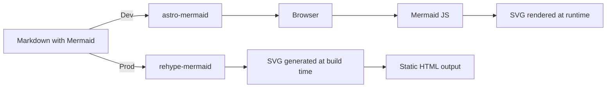

_Mermaid rendering paths in Astro: client-side during development, build-time SVG generation for production._

## Why Mermaid Rendering Matters in a Static Astro Site

Mermaid is a powerful way to express ideas visually:

- architecture diagrams
- flowcharts
- system interactions
- mental models

In an Astro project—especially one that is fully precompiled into static pages—how Mermaid diagrams are rendered has a direct impact on:

- user experience
- perceived performance
- layout stability (flash / shift)
- long-term maintainability

At first glance, adding Mermaid support to Astro looks trivial. In practice, once you care about build-time output and dev/prod parity, the details start to matter.

This post documents my journey of rendering Mermaid diagrams at build time in Astro, and what I learned along the way.

---

## Step 1: Starting With `astro-mermaid`

The most straightforward option is `astro-mermaid`.

Setup is simple:

- install the integration
- enable it in `astro.config`
- write Mermaid code blocks in Markdown

This works well, especially during development.

However, there is an important detail that is easy to miss:

> `astro-mermaid` renders diagrams on the client.

That means:

- Mermaid code is shipped to the browser
- SVGs are generated at runtime
- diagrams appear after the page loads

---

## Why Client-Side Rendering Wasn’t Ideal

My Astro site is fully precompiled into static HTML.

In that context:

- there is no reason not to pre-render diagrams
- client-side Mermaid introduces a small but visible flash
- layout stability is slightly affected
- SEO and performance can be improved with static SVGs

So the goal became clear:

> Precompile Mermaid diagrams into SVGs during `npm run build`.

---

## Step 2: Switching to `rehype-mermaid` for Build-Time Rendering

To move Mermaid rendering into the build pipeline, I switched to `rehype-mermaid`.

This plugin runs during Markdown processing and converts Mermaid code blocks directly into SVGs at build time.

From a rendering perspective, this was exactly what I wanted:

- no client-side JavaScript
- no runtime diagram generation
- fully static output

Theme configuration was also straightforward, and could be aligned with what I used in development.

Visually, however, something still felt off.

---

## The Subtle Problem: Structural Differences

Even with the same Mermaid theme, development and production output did not look the same.

The reason turned out not to be styling, but structure.

### `astro-mermaid` output (development)

```html
<pre class="mermaid">
  <svg>...</svg>
</pre>
```

### `rehype-mermaid` output (build)

```html
<svg>...</svg>
```

That missing wrapper is significant.

The `<pre>` element in development:

- naturally centers the SVG
- provides a container for background and spacing
- makes diagrams feel visually intentional

With build-time rendering, I was left with bare SVGs:

- left-aligned
- no background
- awkward spacing

At this point it became clear that this was not a theming issue, but a DOM structure issue.

---

## Step 3: Fixing Structure Instead of Fighting CSS

Rather than trying to force SVG layout using CSS alone, I chose to fix the structure at the source.

The idea was simple:

- let `rehype-mermaid` generate the SVG
- post-process the AST
- wrap each Mermaid SVG in a container

### Desired Output

```html
<div class="mermaid">
  <svg>...</svg>
</div>
```

Now:

- layout and presentation belong to the wrapper
- the SVG remains untouched
- development and build outputs are conceptually aligned

---

## Step 4: Writing a Small Rehype Wrapper Plugin

I implemented a small rehype plugin that runs after `rehype-mermaid`.

What it does:

- walks the HAST tree
- finds `<svg>` elements whose `id` starts with `mermaid-`
- replaces them with a wrapper element

Conceptually:

```ts
visit(tree, "element", (node, index, parent) => {
  if (node.tagName === "svg" && node.properties.id.startsWith("mermaid-")) {
    parent.children[index] = {
      type: "element",
      tagName: "div",
      properties: { className: ["mermaid"] },
      children: [node],
    };
  }
});
```

This transformation happens entirely at build time, with no client-side cost.

---

## Step 5: Styling the Wrapper (Not the SVG)

Once the wrapper exists, styling becomes trivial and intentional.

```css
div.mermaid {
  width: 100%;
  display: flex;
  justify-content: center;
  align-items: center;

  background: rgba(0, 0, 0, 0.02);
  padding: 24px;
  border-radius: 16px;

  margin: 32px 0;
  overflow-x: auto;
}
```

Key decision:

- the SVG itself is never styled
- the wrapper owns layout, spacing, and background
- Mermaid output remains pure and future-proof

---

## Final Setup: Development vs Production

The final setup looks like this:

### Development

- `astro-mermaid`
- fast feedback loop
- client-side rendering is acceptable

### Production Build

- `rehype-mermaid`
- custom wrapper plugin
- static SVG output
- no flash, better UX

This split provides a good balance between developer experience and production performance.

---

## Final Takeaway

What surprised me most in this process was that:

- the hard part wasn’t Mermaid itself
- it wasn’t theming
- it was structure

Once the DOM structure was correct, everything else became simple.

If you are using Astro as a static-first framework, I would strongly recommend:

- rendering diagrams at build time
- fixing structure instead of compensating with CSS
- treating diagrams as first-class build artifacts

Hopefully this saves someone else a few rounds of trial and error.
