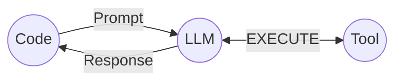
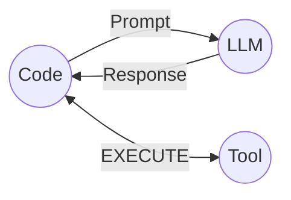

## Why “AI Tools” Exist At All

LLMs are great at **thinking in language**.

But they cannot reliably:

- fetch fresh data
- query your database
- hit an API
- read your files
- run code
- take actions in the world

So “tools” were introduced as the missing bridge:

> **LLM = decision-making / reasoning**  
> **Tools = execution / interaction with external systems**

Tools turn an LLM from “a smart text box” into something that can **do real work**—while keeping the dangerous parts (actions) inside **bounded, inspectable code**.

---

## What a “Tool” Means (In AI Context)

A tool is just a **function** (or API endpoint) that your application exposes to the model via a **schema**.

The schema tells the model:

- what the tool is called
- what it does
- what arguments it expects (and their types)

Then, when the model decides it needs the tool, it returns a structured message containing:

- the tool name
- JSON arguments

Your **code** receives that request, runs the tool, and sends the results back to the model.

No magic. No autonomy. Just a contract.

---

## The Popular Misunderstanding

Many people imagine this:

### ❌ Misunderstanding: “The LLM directly executes tools”



This mental model suggests the LLM has:

- direct access to infrastructure
- execution privileges
- agency over your systems

That is **not** how tool calling works.

---

## The Correct Mental Model

### ✅ Reality: “The LLM requests; your code executes”



What actually happens:

1. Your application sends messages to the LLM.
2. The LLM replies with either:
   - a normal text response, or
   - a **tool request** (structured JSON)
3. Your application validates the request.
4. Your application executes the tool.
5. Tool results are sent back to the LLM.
6. The LLM produces a final user-facing answer.

The LLM never “runs” anything.  
It only **asks**.

---

## Demo: Tool Calling With Shopping Prices

Below is a minimal demo showing how tool calling works using a shopping-price example.

<style>
  .demo-iframe-wrap {
    width: 100%;
    margin: 1rem 0;
  }
  .demo-iframe {
    width: 100%;
    border: 0;
    height: 850px;
  }
  @media (max-width: 643px) {
    .demo-iframe {
      height: 990px;
    }
  }
  @media (max-width: 488px) {
    .demo-iframe {
      height: 1040px;
    }
  }
  @media (max-width: 473px) {
    .demo-iframe {
      height: 1150px;
    }
  }
</style>

<div class="demo-iframe-wrap">
  <iframe
    class="demo-iframe"
    src="https://shuaibird-ai-tools-tool-calling-demo.hf.space"
    loading="lazy"
  ></iframe>
</div>

You can ask:

- "How much is AirPods Pro?"
- "Compare AirPods Pro and Nintendo Switch"
- "If AirPods Pro is under $250, also check Kindle Paperwhite."

---

### 1) Define the Real Tool Function

```python
import json

ITEM_PRICES = {
    "airpods pro": 199,
    "iphone 15": 799,
    "nintendo switch": 299,
    "kindle paperwhite": 149,
}

def get_item_price(item_name: str) -> str:
    print(f"[tool] get_item_price called with item_name={item_name!r}")
    key = item_name.lower()
    price = ITEM_PRICES.get(key)

    if price is None:
        return f"Unknown item: {item_name}"

    return f"{item_name} costs ${price}"
```

This is **real code**.  
Deterministic. Testable. Auditable.

---

### 2) Describe the Tool for the LLM (Schema)

```python
price_function = {
    "name": "get_item_price",
    "description": "Get the price of a shopping item by name.",
    "parameters": {
        "type": "object",
        "properties": {
            "item_name": {
                "type": "string",
                "enum": [
                    "AirPods Pro",
                    "iPhone 15",
                    "Nintendo Switch",
                    "Kindle Paperwhite"
                ],
                "description": "Must be one of the supported catalog items."
            }
        },
        "required": ["item_name"],
        "additionalProperties": False
    }
}

tools = [{"type": "function", "function": price_function}]
```

This schema is **not code execution**.  
It’s a _capability description_.

---

### 3) Single Tool Call Handling

```python
def handle_tool_call(message):
    tool_call = message.tool_calls[0]
    arguments = json.loads(tool_call.function.arguments)
    item_name = arguments["item_name"]

    result = get_item_price(item_name)

    return {
        "role": "tool",
        "content": result,
        "tool_call_id": tool_call.id
    }
```

---

### 4) Chat Loop

```python
def chat(message, history):
    messages = [{"role": "system", "content": system_message}] + history
    messages.append({"role": "user", "content": message})

    response = openai.chat.completions.create(
        model=MODEL,
        messages=messages,
        tools=tools
    )

    if response.choices[0].finish_reason == "tool_calls":
        assistant_msg = response.choices[0].message
        tool_msg = handle_tool_call(assistant_msg)

        messages.append(assistant_msg)
        messages.append(tool_msg)

        response = openai.chat.completions.create(
            model=MODEL,
            messages=messages
        )

    return response.choices[0].message.content
```

---

## Example Q&A

**User:** How much is AirPods Pro?  
**Assistant:** AirPods Pro costs $199.

Internally:

- LLM requests `get_item_price("AirPods Pro")`
- Your code executes
- Result is returned to the model

---

## Exception #1: Multiple Tool Calls

If the user asks:

> Compare AirPods Pro and Nintendo Switch prices

The model may return **multiple tool calls**.

### Fix: Handle All Tool Calls

```python
def handle_tool_calls(message):
    responses = []

    for tool_call in message.tool_calls:
        arguments = json.loads(tool_call.function.arguments)
        item_name = arguments["item_name"]
        result = get_item_price(item_name)

        responses.append({
            "role": "tool",
            "content": result,
            "tool_call_id": tool_call.id
        })

    return responses
```

### Result

**Assistant:**

- AirPods Pro: $199
- Nintendo Switch: $299

---

## Exception #2: Nested Tool Calls

User prompt:

> If AirPods Pro is under $250, also check Kindle Paperwhite.

This requires **multiple rounds** of tool calls.

### Fix: Loop Until No More Tool Requests

```python
def chat(message, history):
    messages = [{"role": "system", "content": system_message}] + history
    messages.append({"role": "user", "content": message})

    response = openai.chat.completions.create(
        model=MODEL,
        messages=messages,
        tools=tools
    )

    while response.choices[0].message.tool_calls:
        assistant_msg = response.choices[0].message
        tool_msgs = handle_tool_calls(assistant_msg)

        messages.append(assistant_msg)
        messages.extend(tool_msgs)

        response = openai.chat.completions.create(
            model=MODEL,
            messages=messages,
            tools=tools
        )

    return response.choices[0].message.content
```

### Result

**Assistant:**

- AirPods Pro costs $199
- Kindle Paperwhite costs $149

---

## Final Takeaway

Tools don’t make LLMs autonomous.

They make AI systems:

- grounded
- inspectable
- controllable
- production-safe

The LLM reasons.  
Your code executes (and enforces guardrails).
