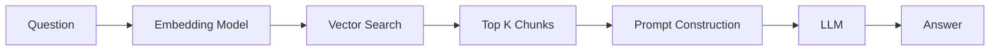

## Why RAG Matters

RAG (Retrieval-Augmented Generation) has become a common pattern in many AI products.

It powers chat over documents.
It powers internal knowledge bots.
It powers most “AI over your data” products.

But here’s the truth:

> RAG works… until retrieval fails.

Let’s break it down clearly.

---

## How RAG Actually Works

RAG sounds complex, but the idea is simple:

> Find relevant context → give it to the LLM → let it answer.

The pipeline looks like this:



### 1) User asks a question

Your system receives a question like:

> “Who is the CEO of the company Y?”

### 2) Convert question into a vector

An embedding model turns the question into numbers (a vector).

Why?

Because we can compare vectors mathematically.

### 3) Search the vector database

You compare the question vector to stored document chunk vectors.

You retrieve the **top K most similar chunks**.

### 4) Build the prompt

You create a prompt that includes:

- The retrieved chunks
- The user question

### 5) LLM generates the answer

The LLM reads the context and produces the final answer.

---

## Why RAG Is Kind of a Hack

LLMs don’t actually “know” your documents.

So we:

- store chunks outside the model
- retrieve them at runtime
- inject them into the prompt

We hope:

- the right chunk is retrieved
- it appears high enough
- it fits in the context window
- the model uses it properly

If retrieval fails:

- Wrong chunk retrieved → hallucination
- Right chunk ranked too low → ignored
- Missing chunk → incomplete answer

And here’s the key:

> If the right context is not retrieved, the LLM cannot save you.

This is why retrieval evaluation matters.

---

## Why We Must Evaluate Retrieval Separately

There are two different problems in a RAG system:

- Retrieval quality
- LLM reasoning quality

Do not mix them.

If the final answer is wrong, you need to know:

- Did retrieval fail?
- Or did the model fail to reason correctly over good context?

In practice, once a reasonably strong LLM is in place, most performance differences in RAG systems come from retrieval quality.

This is also where RAG engineering is most practical to iterate. Instead of evaluating only the final answer, we can experiment directly on retrieval — adjusting chunking strategies, embedding models, or top-K logic — and measure their impact in isolation.

Retrieval experiments are cheaper, faster to run, and give clearer signals about where the system is failing.

So we measure retrieval directly.

That’s where retrieval metrics come in.

---

## Retrieval Metrics

These metrics don’t measure language quality.

They measure ranking quality.

They answer:

> “Did the retriever put the right chunks near the top?”

### MRR — Mean Reciprocal Rank

MRR looks at:

> Where was the first relevant chunk?

If the first relevant chunk is:

- Rank 1 → score = 1/1 = 1.0
- Rank 2 → score = 1/2 = 0.5
- Rank 3 → score = 1/3 = 0.33

Higher is better.

MRR focuses only on the **first correct hit**.

Good when:

- One chunk is enough to answer the question.

```python
def reciprocal_rank(relevance):
    for i, rel in enumerate(relevance, start=1):
        if rel:
            return 1 / i
    return 0
```

### nDCG — Normalized Discounted Cumulative Gain

nDCG asks:

> Did relevant chunks rank higher than irrelevant ones?

It rewards:

- Relevant chunks appearing early
- Multiple relevant chunks appearing near the top

It is more flexible than MRR.

Good when:

- Multiple chunks are needed to answer correctly.

```python
import math

def ndcg_at_k(relevance, k):
    dcg = sum(rel / math.log2(i + 1)
              for i, rel in enumerate(relevance[:k], start=1))
    ideal = sorted(relevance[:k], reverse=True)
    idcg = sum(rel / math.log2(i + 1)
               for i, rel in enumerate(ideal, start=1))
    return dcg / idcg if idcg > 0 else 0
```

### Recall@K

Recall@K asks:

> Was the relevant chunk inside the top K?

Example (K = 5):

- If the correct chunk is in top 5 → success
- If it’s at rank 6 → failure

This measures **coverage**.

It answers:

> “Did we retrieve it at all?”

```python
def recall_at_k(relevance, k, total_relevant):
    return sum(relevance[:k]) / total_relevant if total_relevant else 0
```

### Precision@K

Precision@K asks:

> Among the top K chunks, how many were actually relevant?

If top 5 contains:

- 4 relevant chunks → precision = 0.8
- 1 relevant chunk → precision = 0.2

This measures **noise level**.

It answers:

> “Are we retrieving too much irrelevant stuff?”

```python
def precision_at_k(relevance, k):
    return sum(relevance[:k]) / k if k else 0
```

---

## What Kind of Questions Do These Metrics Optimize?

These ranking metrics (MRR, nDCG, Recall@K, Precision@K) are designed for questions where:

- The answer exists in specific chunks.
- Retrieval must surface those chunks.
- The LLM mainly summarizes or combines them.

In other words, they optimize for **chunk-level relevance**.

Examples:

- “How many contracts has X signed?”
- “List all features mentioned in section 4.”
- “What requirements are stated in the policy document?”

In these cases, if the correct chunks are not retrieved, the answer will fail.

---

## What About Holistic Questions?

Holistic questions are different.

They require broader coverage, not just one or two highly ranked chunks.

For example:

- “How many contracts has Alice signed?”

If your vector database stores hundreds of contracts, and you want to count how many were signed by a specific person, retrieving just the top 5 similar chunks is not enough. You may need to retrieve _all_ matching contracts, not just the most similar ones.

This is no longer a simple top-K similarity problem. It becomes a coverage or filtering problem.

For tasks like this, what matters is whether the final answer is correct and complete.

Ranking metrics such as MRR or Recall@K are not enough here, because they mainly evaluate whether relevant chunks appear near the top — not whether all necessary information was retrieved.

---

## The Real Lesson

RAG is not about prompt tricks.

It’s about:

- Chunking strategy
- Embedding quality
- Ranking quality
- Evaluation discipline

If retrieval is weak:

- You can’t fix it with a better prompt.
- You can’t fix it with temperature.
- You can’t fix it with chain-of-thought.

RAG works…

Until retrieval fails.

And that’s why evaluation is everything.
